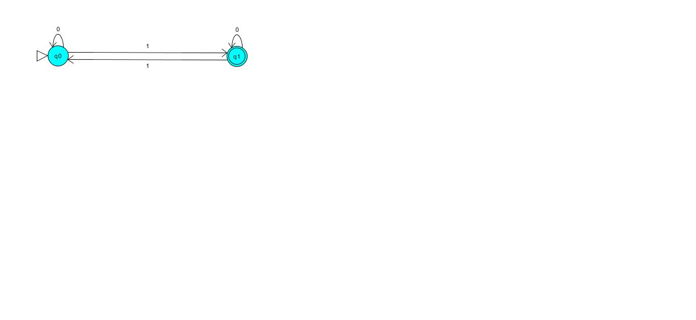

# COMPILADORES 

## EXERCÍCIOS EM SALA 

1 - Construa um autômato que leia 0's e 1's e a quantidade de 1's seja sempre impar.

w = {010, 01110, 001101, ...}



- Gramatica gerada :
```

<q0> ::= 1<q1>
<q0> ::= 0<q0>
<q1> ::= 1<q0>
<q1> ::= 0<q1>
<q1> ::= :no_entry_sign:

```

- Expressão gerada :

```
(0*1)(0+10*1)*

```

